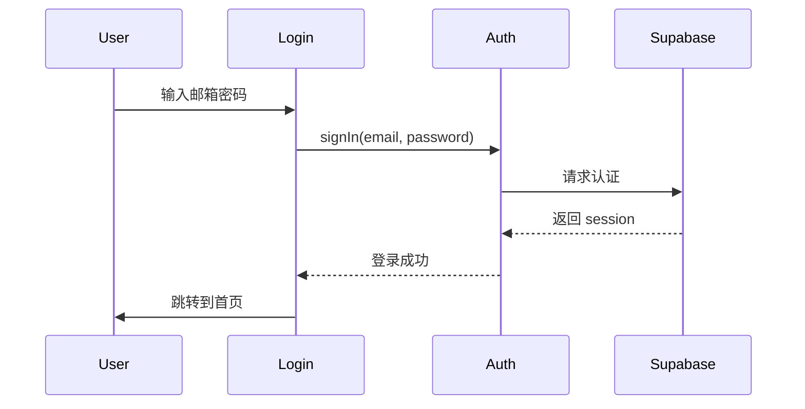
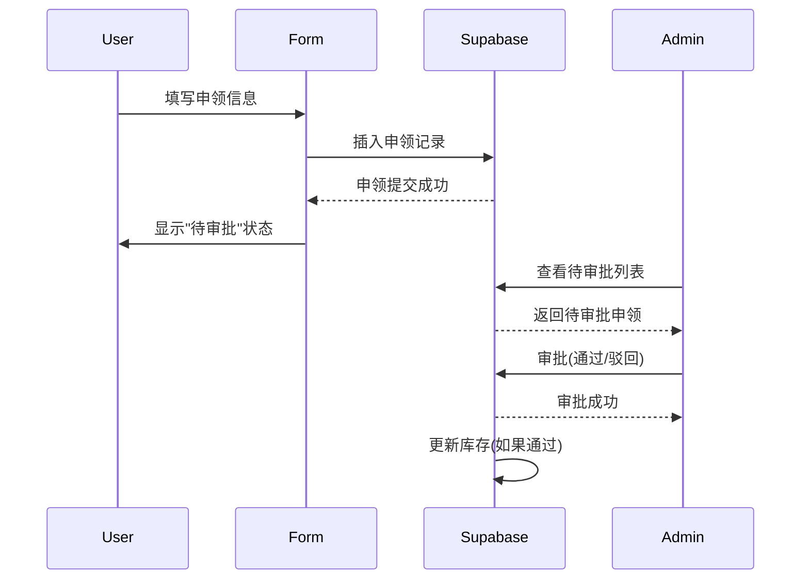

# 开发指南

本文档面向开发人员,提供详细的技术说明和开发指南。

## 目录

1. [技术架构](#技术架构)
2. [开发环境搭建](#开发环境搭建)
3. [项目结构说明](#项目结构说明)
4. [核心功能实现](#核心功能实现)
5. [数据库设计](#数据库设计)
6. [API 接口说明](#api-接口说明)
7. [扩展开发](#扩展开发)
8. [代码规范](#代码规范)

## 技术架构

### 前端架构

```
┌─────────────────────────────────────────┐
│           React Application            │
├─────────────────────────────────────────┤
│  UI Layer (Ant Design Components)      │
├─────────────────────────────────────────┤
│  Business Logic (Hooks & Services)     │
├─────────────────────────────────────────┤
│  Data Layer (Supabase Client)          │
├─────────────────────────────────────────┤
│  Authentication (Supabase Auth)        │
└─────────────────────────────────────────┘
```

### 技术栈详情

| 层级 | 技术 | 说明 |
|------|------|------|
| 框架 | React 18 | 使用函数组件 + Hooks |
| 语言 | TypeScript | 类型安全 |
| 构建工具 | Vite | 快速开发服务器 |
| UI 库 | Ant Design 5 | 企业级组件库 |
| 路由 | React Router 6 | 客户端路由 |
| 状态管理 | React Hooks | 内置状态管理 |
| 后端/数据库 | Supabase | PostgreSQL + Auth |
| 部署 | Vercel | Serverless 部署 |

## 开发环境搭建

### 必需软件

- **Node.js**: v18.0.0 或更高
- **包管理器**: npm (推荐) 或 yarn
- **代码编辑器**: VS Code (推荐)
- **Git**: 版本控制

### VS Code 扩展推荐

```json
{
  "recommendations": [
    "dbaeumer.vscode-eslint",
    "esbenp.prettier-vscode",
    "bradlc.vscode-tailwindcss",
    "ms-vscode.vscode-typescript-next"
  ]
}
```

### 环境配置

1. **克隆仓库**:

```bash
git clone <repository-url>
cd material-management-system
```

2. **安装依赖**:

```bash
npm install
```

3. **配置环境变量**:

```bash
cp .env.example .env
```

编辑 `.env`:

```env
VITE_SUPABASE_URL=你的 Supabase URL
VITE_SUPABASE_ANON_KEY=你的 Supabase anon key
```

4. **启动开发服务器**:

```bash
npm run dev
```

## 项目结构说明

```
src/
├── components/           # 可复用组件
│   ├── AdminLayout.tsx   # 管理员布局(侧边栏 + 头部)
│   └── EmployeeLayout.tsx # 员工布局
├── lib/                  # 工具库和配置
│   ├── supabase.ts       # Supabase 客户端 + 类型定义
│   └── auth.ts           # 认证相关函数
├── pages/                # 页面组件
│   ├── Login.tsx         # 登录/注册页面
│   ├── Dashboard.tsx     # 首页仪表盘
│   ├── Materials.tsx     # 物资列表
│   ├── MyRequisitions.tsx # 我的申领记录(包含申领功能)
│   └── admin/            # 管理员页面
│       ├── Approvals.tsx           # 审批管理
│       ├── MaterialManagement.tsx  # 物资管理
│       └── UserManagement.tsx      # 用户管理
├── App.tsx               # 应用主组件(路由配置)
├── main.tsx              # 应用入口
└── index.css             # 全局样式
```

### 关键文件说明

#### `src/lib/supabase.ts`

Supabase 客户端配置和类型定义:

```typescript
import { createClient } from '@supabase/supabase-js'

// 创建 Supabase 客户端
export const supabase = createClient(
  import.meta.env.VITE_SUPABASE_URL,
  import.meta.env.VITE_SUPABASE_ANON_KEY
)

// 类型定义
export interface Material {
  id: string
  name: string
  stock: number
  // ... 其他字段
}
```

#### `src/lib/auth.ts`

认证相关工具函数:

```typescript
// 登录
export async function signIn(email: string, password: string)

// 注册
export async function signUp(email: string, password: string, fullName?: string)

// 登出
export async function signOut()

// 获取当前用户
export async function getCurrentUser()

// 检查是否为管理员
export async function isAdmin(): Promise<boolean>
```

## 核心功能实现

### 1. 用户认证流程

#### 登录流程



**代码实现** (`src/lib/auth.ts`):

```typescript
export async function signIn(email: string, password: string) {
  const { data, error } = await supabase.auth.signInWithPassword({
    email,
    password,
  })

  if (error) {
    throw error
  }

  return data
}
```

### 2. 物资申领流程

#### 申领流程



**代码实现** (`src/pages/MyRequisitions.tsx`):

```typescript
async function handleSubmit(values: any) {
  // 1. 插入申领记录
  const { error } = await supabase
    .from('requisitions')
    .insert({
      user_id: user.id,
      requisition_type: 'daily_request',
      material_id: values.material_id,
      request_quantity: values.quantity,
      purpose: values.purpose,
      status: 'pending'
    })

  // 2. 刷新列表
  fetchRequisitions()
}
```

### 3. 审批流程

**代码实现** (`src/pages/admin/Approvals.tsx`):

```typescript
async function handleApproval(values: { result: 'approved' | 'rejected'; opinion: string }) {
  // 1. 创建审批记录
  await supabase.from('approvals').insert({
    requisition_id: currentRequisition.id,
    approver_id: user.id,
    result: values.result,
    opinion: values.opinion
  })

  // 2. 更新申领状态
  await supabase
    .from('requisitions')
    .update({ status: values.result === 'approved' ? 'approved' : 'rejected' })
    .eq('id', currentRequisition.id)

  // 3. 如果是日常申领且通过,扣减库存
  if (currentRequisition.requisition_type === 'daily_request' && values.result === 'approved') {
    // 更新库存
    await supabase.from('materials').update({ stock: newStock }).eq('id', materialId)

    // 记录库存流水
    await supabase.from('inventory_logs').insert({
      material_id: materialId,
      operation_type: 'request_out',
      quantity: -quantity,
      stock_before: oldStock,
      stock_after: newStock
    })
  }
}
```

## 数据库设计

### ER 图

```
┌─────────────┐         ┌────────────────┐
│   profiles  │◄────────│ auth.users     │
│             │         │                │
│ - id        │         │ - id           │
│ - email     │         │ - email        │
│ - role      │         │ - password     │
│ - full_name │         └────────────────┘
└─────────────┘
       │
       │ 1
       │
       │ *
┌──────────────┐         ┌──────────────┐
│ requisitions │         │  materials   │
│              │         │              │
│ - id         │────────│ - id         │
│ - user_id    │         │ - name       │
│ - type       │         │ - stock      │
│ - status     │         │ - safe_stock │
│ - material_id│         └──────────────┘
└──────────────┘                 │
       │                         │
       │ 1                       │ 1
       │                         │
       │ *                       │ *
┌──────────────┐         ┌──────────────┐
│  approvals   │         │inventory_logs│
│              │         │              │
│ - id         │         │ - id         │
│ - req_id     │         │ - material_id│
│ - approver_id│         │ - quantity   │
│ - result     │         │ - operation  │
└──────────────┘         └──────────────┘
```

### 表关系说明

- **profiles** ← **auth.users**: 一对一
- **requisitions** → **profiles**: 多对一
- **requisitions** → **materials**: 多对一(可选)
- **approvals** → **requisitions**: 多对一
- **inventory_logs** → **materials**: 多对一

## API 接口说明

Supabase 客户端提供标准的 CRUD 操作:

### 查询数据

```typescript
// 查询所有物资
const { data, error } = await supabase
  .from('materials')
  .select('*')
  .eq('status', 'active')

// 查询带关联
const { data, error } = await supabase
  .from('requisitions')
  .select('*, profiles:user_id(full_name)')

// 分页查询
const { data, error } = await supabase
  .from('materials')
  .select('*')
  .range(0, 9) // 前10条
```

### 插入数据

```typescript
const { data, error } = await supabase
  .from('requisitions')
  .insert({
    user_id: user.id,
    material_id: materialId,
    request_quantity: 5,
    purpose: '办公使用',
    status: 'pending'
  })
```

### 更新数据

```typescript
const { data, error } = await supabase
  .from('requisitions')
  .update({ status: 'approved' })
  .eq('id', requisitionId)
```

### 删除数据

```typescript
const { error } = await supabase
  .from('materials')
  .delete()
  .eq('id', materialId)
```

### 实时订阅

```typescript
// 订听申领状态变化
const subscription = supabase
  .channel('requisitions')
  .on('postgres_changes', {
    event: '*',
    schema: 'public',
    table: 'requisitions'
  }, (payload) => {
    console.log('Change received!', payload)
    fetchRequisitions() // 刷新列表
  })
  .subscribe()

// 取消订阅
subscription.unsubscribe()
```

## 扩展开发

### 添加新页面

1. 在 `src/pages/` 创建新组件:

```typescript
// src/pages/NewPage.tsx
export default function NewPage() {
  return (
    <div>
      <h2>新页面</h2>
      {/* 页面内容 */}
    </div>
  )
}
```

2. 在 `src/App.tsx` 添加路由:

```typescript
<Route
  path="/new-page"
  element={
    <ProtectedRoute>
      <NewPage />
    </ProtectedRoute>
  }
/>
```

### 添加新功能

示例: 添加"库存预警"功能

1. 在 Supabase 中创建视图:

```sql
CREATE OR REPLACE VIEW low_stock_alerts AS
SELECT
  m.id,
  m.name,
  m.stock,
  m.safe_stock,
  (m.safe_stock - m.stock) AS shortage
FROM materials m
WHERE m.stock < m.safe_stock;
```

2. 在前端实现:

```typescript
// 获取库存预警
async function fetchLowStockAlerts() {
  const { data, error } = await supabase
    .from('low_stock_alerts')
    .select('*')
    .order('shortage', { ascending: false })

  return data
}
```

### 自定义主题

修改 `src/index.css`:

```css
/* 主题色 */
:root {
  --primary-color: #1890ff;
  --success-color: #52c41a;
  --warning-color: #faad14;
  --error-color: #f5222d;
}

/* 全局样式覆盖 */
.ant-btn-primary {
  background-color: var(--primary-color);
}
```

## 代码规范

### TypeScript 规范

```typescript
// ✅ 好的做法: 使用类型注解
interface User {
  id: string
  name: string
}

const getUser = async (id: string): Promise<User | null> => {
  const { data } = await supabase
    .from('profiles')
    .select('*')
    .eq('id', id)
    .single()
  return data
}

// ❌ 避免: 使用 any
const getUser = async (id: string): any => {
  // ...
}
```

### 命名规范

- **组件**: PascalCase (如 `UserList`)
- **函数**: camelCase (如 `fetchUsers`)
- **常量**: UPPER_SNAKE_CASE (如 `API_BASE_URL`)
- **类型**: PascalCase (如 `UserProfile`)

### 组件结构

```typescript
// 推荐的结构
export default function ComponentName() {
  // 1. Hooks
  const [state, setState] = useState()

  // 2. Effects
  useEffect(() => {
    // ...
  }, [])

  // 3. 事件处理函数
  const handleClick = () => {
    // ...
  }

  // 4. 渲染
  return (
    <div>
      {/* JSX */}
    </div>
  )
}
```

### 错误处理

```typescript
// ✅ 好的做法: 完整的错误处理
async function fetchData() {
  try {
    const { data, error } = await supabase
      .from('materials')
      .select('*')

    if (error) {
      throw error
    }

    setData(data)
  } catch (error) {
    console.error('获取数据失败:', error)
    message.error('获取数据失败,请重试')
  }
}

// ❌ 避免: 忽略错误
async function fetchData() {
  const { data } = await supabase.from('materials').select('*')
  setData(data)
}
```

## 测试

### 单元测试(待实现)

```typescript
// 示例: 测试认证函数
import { describe, it, expect } from 'vitest'
import { signIn } from '../lib/auth'

describe('Authentication', () => {
  it('should sign in with valid credentials', async () => {
    const result = await signIn('test@example.com', 'password123')
    expect(result.user).toBeDefined()
  })
})
```

### E2E 测试(待实现)

使用 Playwright 或 Cypress 进行端到端测试。

---

继续开发愉快! 🚀
